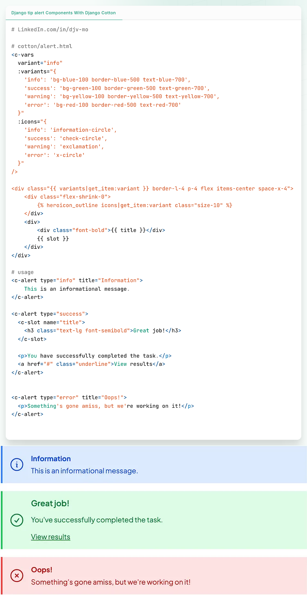

# Alert Components

Source = https://www.reddit.com/r/django/comments/1leg6cn/django_tip_alert_components_with_django_cotton/#lightbox



## Template

```django
# cotton/alert.html
<c-vars
variant="info"

：variants="{
    'info': 'bg-blue-100 border-blue-500 text-blue-700',
    'success': 'bg-green-100 border-green-500 text-green-700',
    'warning': 'bg-yellow-100 border-yellow-500 text-yellow-700',
    'error': 'bg-red-100 border-red-500 text-red-700'
}"

:icons="{
    'info': 'information-circle',
    'success': 'check-circle',
    'warning': 'exclamation',
    'error': 'x-circle'
}"

<div class="{{ variants|get_item:variant }} border-1-4 p-4 flex items-center space-x-4">
    <div class="flex-shrink-0">
        
    </div>
    <div>
        <div class="font-bold">{{ title }}</div>
        {{ slot }}
    </div>
</div>

```

## Usage

```django
<c-alert type="info" title="Information">
    This is an informational message.
</c-alert>

<c-alert type="success">
    <c-slot name="title">
        <h3 class="text-lg font-semibold">Great job!</h3>
    </c-slot>
    <p>You have successfully completed the task.</p> <a href="#" class="underline">View results</a>
</c-alert>

<c-alert type="error" title="Oops!">
    <p>Something's gone amiss, but we're working on it!</p>
</c-alert>

```